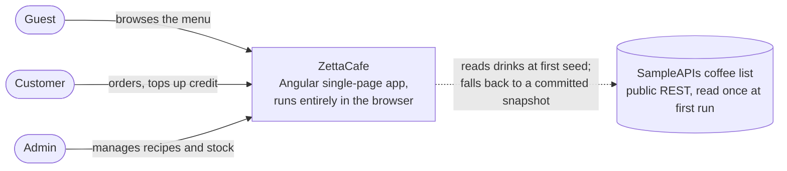
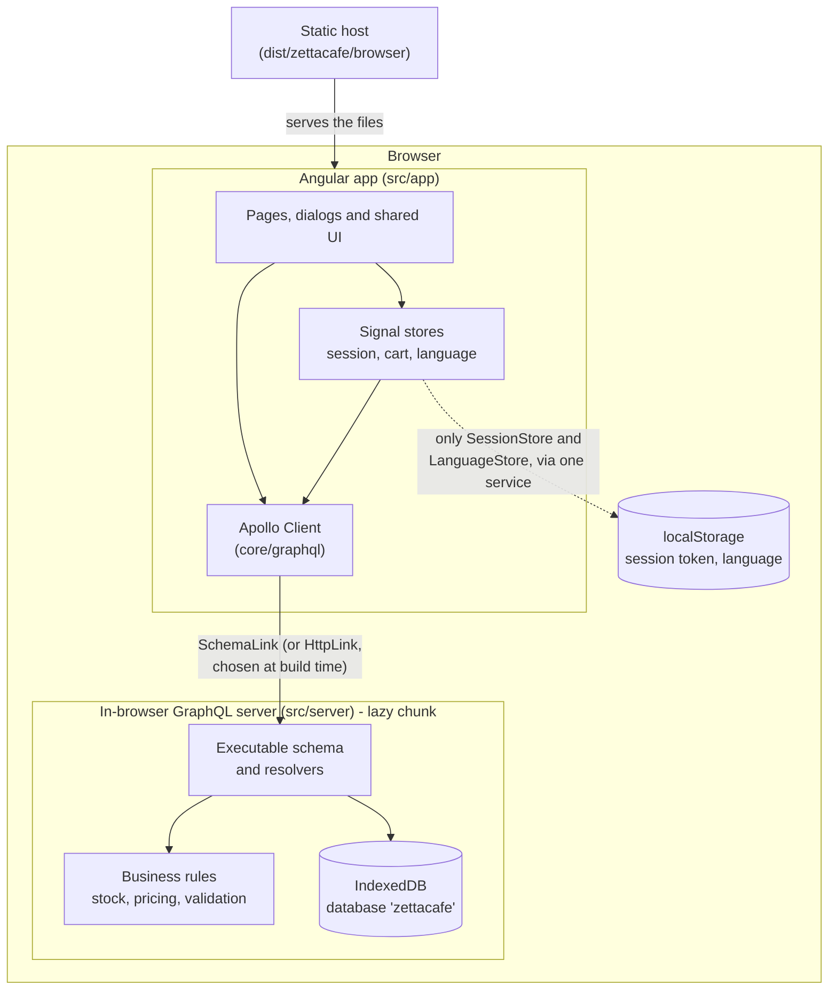
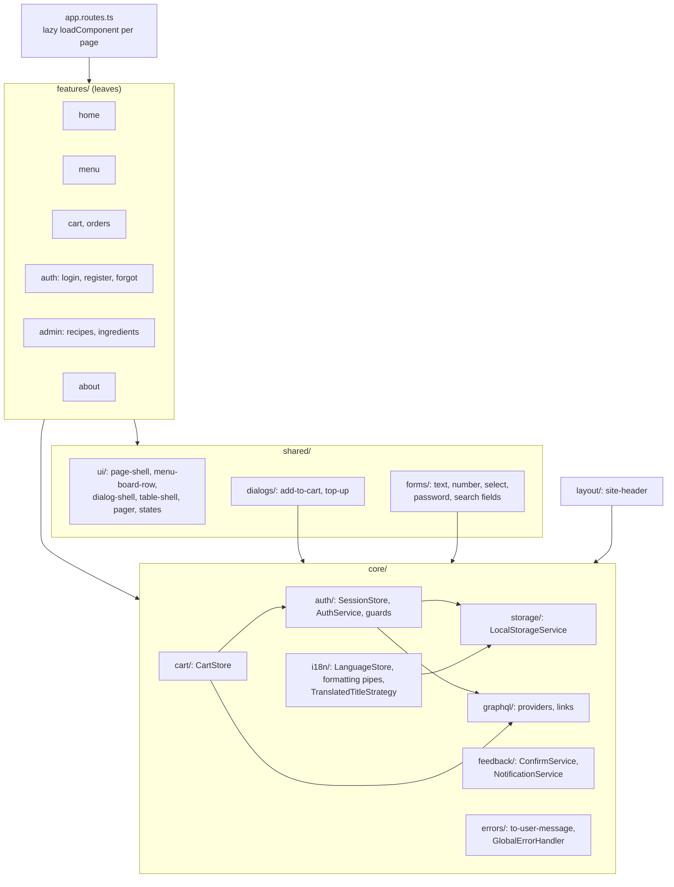
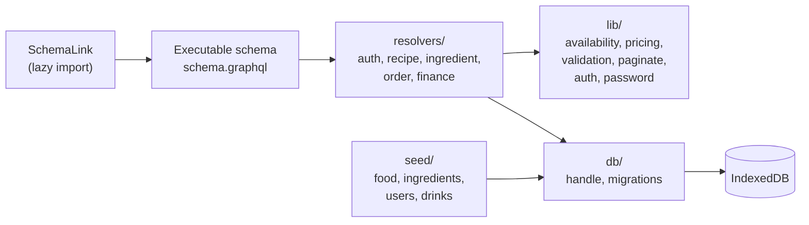
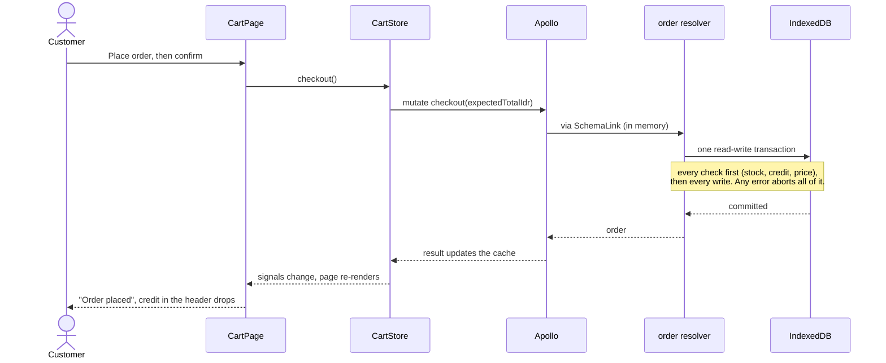

# Architecture

ZettaCafe is a single-page Angular application with no server. Its GraphQL API runs
in the browser and stores data in IndexedDB. This page describes the system at three
levels of zoom (context, containers, components), following the C4 model, and then
the rules that keep the structure honest.

Related: [data layer](DATA-LAYER.md), [theming](THEMING.md), [testing](TESTING.md),
[decision records](adr/README.md).

## 1. Context

Who uses it and what it touches.

There is one external dependency and it is optional. If the coffee list is down or
slow (over three seconds), the app uses a snapshot committed in the repository, so
the menu never depends on a third party being up.

| Role     | Can do                                                                        |
| -------- | ----------------------------------------------------------------------------- |
| Guest    | Browse and search the menu, read About. Adding a dish asks them to sign in.   |
| Customer | Everything a guest can, plus cart, checkout, order history and adding credit. |
| Admin    | Everything a customer can, plus recipes, ingredients and the revenue figures. |

## 2. Containers

There is one deployable unit, a static site. Inside the browser it is two cooperating
parts with a hard boundary between them.

The boundary that matters is between `src/app` and `src/server`. The server has no
Angular in it, so its tests need no `TestBed`, and the whole directory could move to
a Node package unchanged. The app reaches it only through Apollo, and only through a
dynamic `import()`, so the server is a separate chunk (about 110 kB) fetched on the
first operation rather than part of the initial download.

## 3. Components

### The Angular app

What each part is for:

- **features/**: one folder per screen. A feature owns its page, its GraphQL
  documents (`*.graphql`, with generated types beside them) and a thin service that
  turns Apollo results into the shape its template needs. Features never import each
  other.
- **shared/ui/**: presentational components with inputs and outputs and no knowledge
  of the data layer. `menu-board-row` (the menu is a board, not a card grid),
  `dialog-shell` (title, close, focus and the read-only scroll region),
  `table-shell` (loading, error, empty and content states in one place), `pager`.
- **shared/forms/**: field components that wrap Material inputs with one label, one
  error area (`field-errors` maps validation errors to translation keys), and
  `focusFirstInvalid`.
- **shared/dialogs/**: dialogs used from more than one feature. Their code is loaded on
  first use, so it is not in the initial bundle.
- **core/**: app-wide singletons. Three signal stores hold all client state
  (`SessionStore`, `CartStore`, `LanguageStore`); `LocalStorageService` is the only
  code that reads `localStorage`, behind a validator, which is why a malformed value
  can never be mistaken for a session.

### The server

Resolvers are thin: they check who is asking, call a pure function from `lib/`, and
read or write through `db/`. The rules (how many servings can be made, what a line
costs, what stops a cart checking out) exist once, in `lib/`, and are unit-tested
without a database.

## 4. How a request flows

Placing an order, end to end:

## 5. The rules that keep it this shape

These are enforced by tooling, not by good intentions, so they hold as the code grows.

| Rule                                                                                                                             | Enforced by                                                                  |
| -------------------------------------------------------------------------------------------------------------------------------- | ---------------------------------------------------------------------------- |
| `src/server` never imports Angular; `src/app` never imports `src/server` except lazily                                           | ESLint import boundaries, plus `scripts/check-bundle.mjs` on the built files |
| `shared/ui` does not import `core`; `shared/forms` and `shared/dialogs` do not import features; features import no other feature | ESLint `no-restricted-imports` zones                                         |
| No `.subscribe(` in features. State is signals, `toSignal` or `rxResource`                                                       | ESLint. Zoneless change detection would not re-render from a plain callback  |
| Only `LocalStorageService` touches `localStorage`                                                                                | ESLint                                                                       |
| No literal colours outside `_tokens.scss`, no `::ng-deep`, no `!important`                                                       | Stylelint                                                                    |
| Every string a person reads is translated, in both languages, with matching placeholders                                         | `npm run i18n:check`                                                         |
| Every text and UI colour pair meets WCAG AA in both themes                                                                       | `npm run contrast:check`                                                     |
| Generated GraphQL code matches the schema                                                                                        | `npm run codegen:check`                                                      |
| Server code and dev tools stay out of the initial bundle                                                                         | `npm run bundle:check`, and size budgets in `angular.json`                   |

## 6. Deployment

`npm run build` produces static files in `dist/zettacafe/browser`. Any static host
works; the only requirement is a fallback to `index.html` for unknown paths, because
routes such as `/menu` are client-side. `scripts/serve-dist.mjs` is a 50-line
example of exactly that, and the end-to-end tests use it.

Dev tooling (`/dev/tokens`, `/dev/graphql`, `/dev/kitchen-sink`, `/dev/session`) is
compiled out of production builds by a build-time `define`, so it is not merely
hidden but absent from the output. A test checks that visiting those paths shows
nothing.
